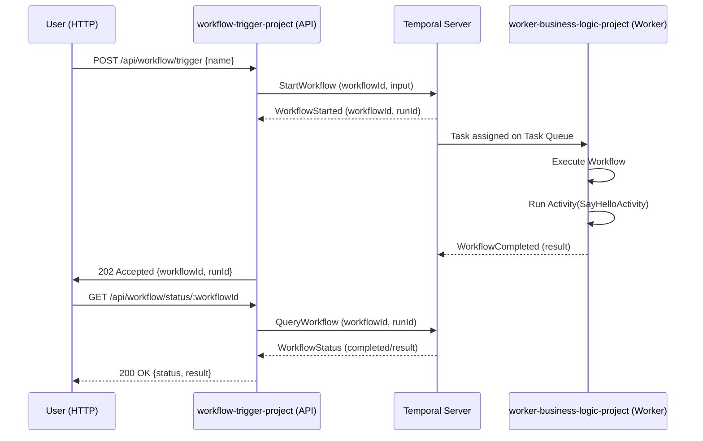

# Go Temporal Microservice Boilerplate (Sync/Async-Background handover)

A beginner-friendly boilerplate for building microservices with Go and Temporal. This project demonstrates how to create a distributed workflow system with a REST API and background workers.

## What is This Project?

This is a simple "Hello World" microservice that shows you how to:
- Build a REST API that triggers background tasks
- Execute long-running workflows using Temporal
- Separate your API layer from your business logic using workers

Think of it like this: Your REST API is like a restaurant's front counter where customers place orders, and the Temporal worker is like the kitchen that actually prepares the food. The API can accept many orders quickly, while workers process them reliably in the background.

## Project Components

1. **workflow-trigger-project** - REST API (The "Front Counter")
   - Receives HTTP requests from users
   - Triggers workflows and checks their status
   - Built with Fiber (a fast web framework)

2. **worker-business-logic-project** - Background Worker (The "Kitchen")
   - Listens for workflow tasks from Temporal
   - Executes the actual business logic
   - Processes workflows and activities

## Architecture Flow

```
User Request (HTTP)
    ↓
workflow-trigger-project (REST API)
    ↓ (triggers workflow)
Temporal Server (Task Manager)
    ↓ (assigns work)
worker-business-logic-project (Worker)
    ↓ (executes and returns result)
Temporal Server (stores result)
    ↓
User can query status via API
```

**Sequence Diagram**

The following Mermaid sequence diagram shows the high-level interaction between the API, Temporal server, worker and the user when triggering a workflow:



## Prerequisites

Before you start, you need to have these installed on your computer:

### 1. Install Go (Version 1.21 or higher)

**macOS:**
```bash
brew install go
```

**Linux:**
```bash
wget https://go.dev/dl/go1.21.0.linux-amd64.tar.gz
sudo tar -C /usr/local -xzf go1.21.0.linux-amd64.tar.gz
export PATH=$PATH:/usr/local/go/bin
```

**Windows:**
Download and install from [https://go.dev/dl/](https://go.dev/dl/)

Verify installation:
```bash
go version
```

### 2. Install Temporal CLI

Temporal is the workflow engine that manages your background tasks. The easiest way to run it locally is using the Temporal CLI.

**Install Temporal CLI on macOS:**
```bash
brew install temporal
```

**Start Temporal Server:**
```bash
temporal server start-dev
```

This will start:
- Temporal Server on `localhost:7233`
- Temporal Web UI on `localhost:8233`

**Verify Temporal is running:**
- Open your browser and go to [http://localhost:8233](http://localhost:8233)
- You should see the Temporal Web UI

**Keep this terminal running!** The Temporal server needs to stay active for the workflows to work.

### 3. Understanding Key Concepts

**What is Temporal?**
Temporal is like a super-reliable task manager for your code. It handles:
- Long-running tasks (sending emails, processing videos)
- Automatic retries if tasks fail
- Remembering task state even if your server crashes
- Complex workflows with multiple steps

**Key Terms:**
- **Workflow**: The plan or recipe (e.g., "First greet the user, then send confirmation")
- **Activity**: A single step of work (e.g., "Send an email")
- **Worker**: The program that executes workflows and activities
- **Task Queue**: A waiting line where workflows are sent and workers pick them up

## Project Structure Explained

```
go-temporal-microservice/
├── workflow-trigger-project/     # REST API (The "Front Counter")
│   ├── main.go                   # Starts the web server
│   ├── handlers/                 # HTTP request handlers
│   │   └── workflow_handler.go   # Handles workflow trigger requests
│   ├── models/                   # Data structures
│   │   └── workflow_types.go     # Request/Response types
│   └── go.mod                    # Project dependencies
│
└── worker-business-logic-project/ # Background Worker (The "Kitchen")
    ├── main.go                    # Starts the worker
    ├── worker.go                  # Worker configuration
    ├── workflow.go                # Workflow definition (orchestration)
    ├── activity.go                # Activity definition (actual work)
    └── go.mod                     # Project dependencies
```

### File Explanations

**workflow-trigger-project:**
- `main.go` - Sets up the Fiber web server and defines API routes
- `handlers/workflow_handler.go` - Contains logic to trigger and query workflows
- `models/workflow_types.go` - Defines the data structures for requests and responses

**worker-business-logic-project:**
- `main.go` - Entry point that starts the worker
- `worker.go` - Connects to Temporal and registers workflows/activities
- `workflow.go` - Defines the HelloWorkflow (the orchestration logic)
- `activity.go` - Defines the SayHelloActivity (the actual work being done)

## Getting Started

**Quick Overview:** You'll need 4 terminal windows running:
1. **Terminal 1:** Temporal Server (`temporal server start-dev`)
2. **Terminal 2:** Install dependencies (can be closed after)
3. **Terminal 3:** Worker (`go run .`)
4. **Terminal 4:** API Server (`go run .`)

### Step 1: Start Temporal Server

Before running the projects, start the Temporal server. Open a terminal and run:

```bash
temporal server start-dev
```

You should see output indicating the server is running. **Keep this terminal window open!**

Verify by opening [http://localhost:8233](http://localhost:8233) in your browser.

### Step 2: Clone or Download This Project

```bash
cd /path/where/you/want/the/project
# If you haven't already, navigate to the project directory
cd go-temporal-microservice-rest-api-background-processor
```

### Step 3: Install Dependencies

Open a **NEW** terminal window and install dependencies for both projects:

```bash
# Install dependencies for the API project
cd workflow-trigger-project
go mod tidy

# Install dependencies for the worker project
cd ../worker-business-logic-project
go mod tidy
```

**What does `go mod tidy` do?**
It downloads all the external libraries (dependencies) your project needs, like Temporal SDK and Fiber (web framework).

### Step 4: Start the Worker (The "Kitchen")

The worker must be running BEFORE you trigger any workflows. Open a **NEW** terminal window (3rd terminal) and run:

```bash
cd worker-business-logic-project
go run .
```

You should see output like:
```
Temporal Worker starting...
- Temporal Host: localhost:7233
- Task Queue: hello-world-task-queue
Waiting for workflow tasks...
```

**Leave this terminal window open!** The worker needs to keep running.

### Step 5: Start the API Server (The "Front Counter")

Open a **NEW** terminal window (4th terminal) and run:

```bash
cd workflow-trigger-project
go run .
```

You should see:
```
Server starting on port :3000
```

**Leave this terminal window open too!**

### Step 6: Test It Out!

Now you have all three services running (Temporal Server, Worker, and API). Let's trigger a workflow!

**Method 1: Using curl (in a new terminal)**

```bash
curl -X POST http://localhost:3000/api/workflow/trigger \
  -H "Content-Type: application/json" \
  -d '{"name": "Darshit"}'
```

**Method 2: Using a REST client like Postman or Insomnia**
- URL: `http://localhost:3000/api/workflow/trigger`
- Method: POST
- Headers: `Content-Type: application/json`
- Body:
  ```json
  {
    "name": "Darshit"
  }
  ```

**Expected Response:**
```json
{
  "workflowId": "hello-workflow-1234567890",
  "runId": "some-unique-run-id",
  "message": "Workflow triggered successfully"
}
```

**Check the worker terminal** - you should see the workflow being executed!

### Step 7: Check Workflow Status

Use the `workflowId` from the previous response:

```bash
curl http://localhost:3000/api/workflow/status/hello-workflow-1234567890
```

**Response:**
```json
{
  "workflowId": "hello-workflow-1234567890",
  "runId": "some-unique-run-id",
  "status": "completed",
  "result": {
    "message": "Hello, Darshit! Welcome to Temporal."
  }
}
```

## How It Works

Let's break down what happens when you trigger a workflow:

### 1. API Receives Request
- User sends a POST request to `/api/workflow/trigger` with a name
- The `TriggerWorkflow` function in [workflow_handler.go](workflow-trigger-project/handlers/workflow_handler.go#L26) receives the request

### 2. Workflow is Queued
- The handler creates a unique workflow ID (e.g., `hello-workflow-1234567890`)
- It sends the workflow to Temporal with the name as input
- Temporal places it in the `hello-world-task-queue`

### 3. Worker Picks Up Workflow
- The worker (running in the other terminal) is constantly watching the task queue
- It sees a new workflow and starts executing it

### 4. Workflow Executes Activity
- The `HelloWorkflow` function in [workflow.go](worker-business-logic-project/workflow.go#L17) runs
- It calls the `SayHelloActivity` function from [activity.go](worker-business-logic-project/activity.go#L8)
- The activity generates the greeting message: "Hello, Darshit! Welcome to Temporal."

### 5. Result is Stored
- Temporal stores the result
- When you check the status via the API, it returns the completed workflow with results

## API Endpoints Reference

### 1. Health Check
```bash
GET http://localhost:3000/
```
Returns basic API information.

**Response:**
```json
{
  "message": "Temporal Workflow Trigger API",
  "version": "1.0.0"
}
```

### 2. Trigger Workflow
```bash
POST http://localhost:3000/api/workflow/trigger
Content-Type: application/json

{
  "name": "Your Name"
}
```
Starts a new workflow and returns the workflow ID.

**Response:**
```json
{
  "workflowId": "hello-workflow-1234567890",
  "runId": "unique-run-id",
  "message": "Workflow triggered successfully"
}
```

### 3. Get Workflow Status
```bash
GET http://localhost:3000/api/workflow/status/:workflowId
```
Returns the status and result of a workflow.

**Query Parameters:**
- `runId` (optional): Specific run ID to query

**Response (Completed):**
```json
{
  "workflowId": "hello-workflow-1234567890",
  "runId": "unique-run-id",
  "status": "completed",
  "result": {
    "message": "Hello, Your Name! Welcome to Temporal."
  }
}
```

**Response (Failed/Running):**
```json
{
  "workflowId": "hello-workflow-1234567890",
  "runId": "unique-run-id",
  "status": "failed or running",
  "error": "error details if failed..."
}
```

## Using This as a Boilerplate

### Customizing for Your Own Project

#### 1. Rename the Projects

```bash
# For the API project
cd workflow-trigger-project
# Edit go.mod and change the module name from "workflow-trigger-project" to "your-project-name"
# Then update imports in all .go files

# For the worker project
cd worker-business-logic-project
# Edit go.mod and change the module name
# Then update imports in all .go files
```

#### 2. Add Your Own Workflow

In [worker.go](worker-business-logic-project/worker.go#L29), register your workflow:
```go
w.RegisterWorkflow(HelloWorkflow)
w.RegisterWorkflow(YourNewWorkflow)  // Add this
```

Create a new workflow file:
```go
// your_workflow.go
package main

import (
    "time"
    "go.temporal.io/sdk/workflow"
)

func YourNewWorkflow(ctx workflow.Context, input YourInput) (YourOutput, error) {
    options := workflow.ActivityOptions{
        StartToCloseTimeout: 10 * time.Second,
    }
    ctx = workflow.WithActivityOptions(ctx, options)

    // Your workflow logic here
    // You can call multiple activities in sequence or parallel

    return YourOutput{}, nil
}
```

#### 3. Add Your Own Activity

Register in [worker.go](worker-business-logic-project/worker.go#L30):
```go
w.RegisterActivity(SayHelloActivity)
w.RegisterActivity(YourNewActivity)  // Add this
```

Create a new activity file:
```go
// your_activity.go
package main

import "context"

func YourNewActivity(ctx context.Context, input string) (string, error) {
    // Your business logic here
    // This could be:
    // - Sending emails
    // - Processing images
    // - Calling external APIs
    // - Database operations
    // - File processing

    return "result", nil
}
```

#### 4. Add New API Endpoints

In [main.go](workflow-trigger-project/main.go#L43), add new routes:
```go
app.Post("/api/your-endpoint", yourHandler.YourMethod)
app.Get("/api/your-resource/:id", yourHandler.GetResource)
```

Create handler methods in the handlers folder following the pattern in [workflow_handler.go](workflow-trigger-project/handlers/workflow_handler.go).

## Configuration

Both projects use the same configuration constants. You can customize them:

**Configuration Values:**
- **Temporal Host**: `localhost:7233` - Where Temporal server is running
- **Task Queue**: `hello-world-task-queue` - The queue name (must match in both projects)
- **API Server Port**: `:3000` - The port for your REST API

**Where to Change:**
- Worker: [worker.go](worker-business-logic-project/worker.go#L11-L12)
- API: [main.go](workflow-trigger-project/main.go#L14-L16)

## Monitoring with Temporal UI

You can monitor workflows in the Temporal Web UI:

1. Open [http://localhost:8233](http://localhost:8233) in your browser
2. You'll see a list of all workflows
3. Look for workflows with ID pattern `hello-workflow-*`
4. Click on any workflow to see:
   - Execution history
   - Input and output data
   - Activity details and timing
   - Any errors that occurred
5. This is extremely helpful for debugging!

## Common Issues & Solutions

### Issue: "Unable to create Temporal client"
**Solution:** Make sure Temporal server is running. Open a terminal and run:
```bash
temporal server start-dev
```
Keep this terminal open and verify the server is accessible at [http://localhost:8233](http://localhost:8233)

### Issue: "Worker not picking up workflows"
**Solution:**
1. Make sure the worker is running (check the terminal)
2. Verify the task queue name matches in both API and worker
3. Check [worker.go](worker-business-logic-project/worker.go#L12) and [main.go](workflow-trigger-project/main.go#L15)

### Issue: "cannot find module"
**Solution:** Run `go mod tidy` in the project directory to download dependencies.

### Issue: Port 3000 already in use
**Solution:** Change the port in [main.go](workflow-trigger-project/main.go#L16):
```go
const ServerPort = ":3001"  // Change to any available port
```

### Issue: Workflow is stuck in "running" state
**Solution:**
- The worker might have crashed - check the worker terminal
- Restart the worker: `cd worker-business-logic-project && go run .`

## Useful Commands

```bash
# Build the API
cd workflow-trigger-project
go build -o api

# Build the worker
cd worker-business-logic-project
go build -o worker

# Run the built binaries
./api      # Run API server
./worker   # Run worker

# Run tests (if you add any)
go test ./...

# Format your code
go fmt ./...

# Check for common mistakes
go vet ./...

# Download dependencies
go mod tidy

# View dependency tree
go mod graph
```

## Resources for Learning

- [Go Documentation](https://go.dev/doc/) - Official Go documentation
- [Go Tour](https://go.dev/tour/) - Interactive introduction to Go
- [Temporal Documentation](https://docs.temporal.io) - Complete Temporal guide
- [Temporal Samples](https://github.com/temporalio/samples-go) - Example projects
- Visit [learn.temporal.io](https://learn.temporal.io)
- [Fiber Framework](https://docs.gofiber.io/) - Fast web framework documentation
- [Go by Example](https://gobyexample.com/) - Learn Go with examples

## Project Dependencies

### workflow-trigger-project
- **Fiber v2** (`github.com/gofiber/fiber/v2`) - Fast HTTP web framework
- **Temporal SDK** (`go.temporal.io/sdk`) - Client library to interact with Temporal

### worker-business-logic-project
- **Temporal SDK** (`go.temporal.io/sdk`) - Worker library to execute workflows and activities


**License**

MIT License

Copyright (c) 2025 Darshit Vvora

Permission is hereby granted, free of charge, to any person obtaining a copy
of this software and associated documentation files (the "Software"), to deal
in the Software without restriction, including without limitation the rights
to use, copy, modify, merge, publish, distribute, sublicense, and/or sell
copies of the Software, and to permit persons to whom the Software is
furnished to do so, subject to the following conditions:

The above copyright notice and this permission notice shall be included in all
copies or substantial portions of the Software.

THE SOFTWARE IS PROVIDED "AS IS", WITHOUT WARRANTY OF ANY KIND, EXPRESS OR
IMPLIED, INCLUDING BUT NOT LIMITED TO THE WARRANTIES OF MERCHANTABILITY,
FITNESS FOR A PARTICULAR PURPOSE AND NONINFRINGEMENT. IN NO EVENT SHALL THE
AUTHORS OR COPYRIGHT HOLDERS BE LIABLE FOR ANY CLAIM, DAMAGES OR OTHER
LIABILITY, WHETHER IN AN ACTION OF CONTRACT, TORT OR OTHERWISE, ARISING FROM,
OUT OF OR IN CONNECTION WITH THE SOFTWARE OR THE USE OR OTHER DEALINGS IN THE
SOFTWARE.


